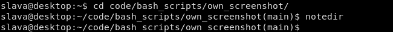
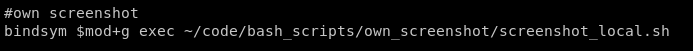

#### Usage

Enter to the directory with your project and execute the following commands:
``` bash
cd <project_dir>
alias notedir="pwd > /tmp/screenshot_local.config"
notedir
```

#### Example

Take into account your bash script have to be executable: 
``` bash
chmod +x filename
```
##### Terminal



##### Shortcut i3


