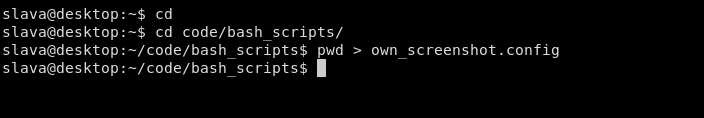
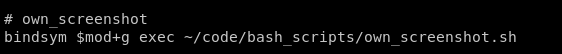

#### Usage

Enter to the directory with your project and execute the following commands:
``` bash
cd
pwd > ~/<directory with this script>/own_screenshot.config
```

#### Example

Take into account your bash script have to be executable: 
``` bash
chmod +x filename
```
##### Terminal



##### Shortcut i3


